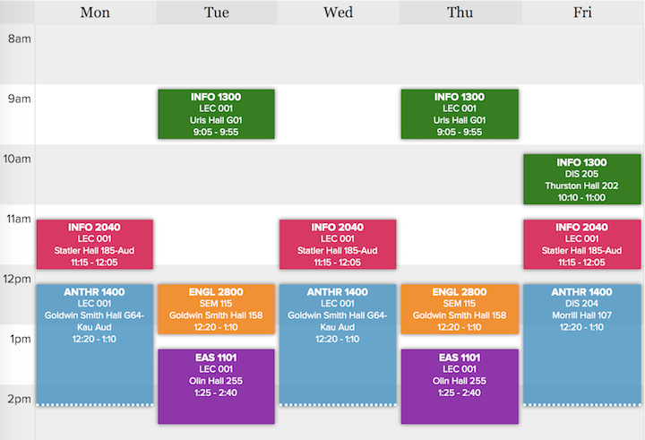
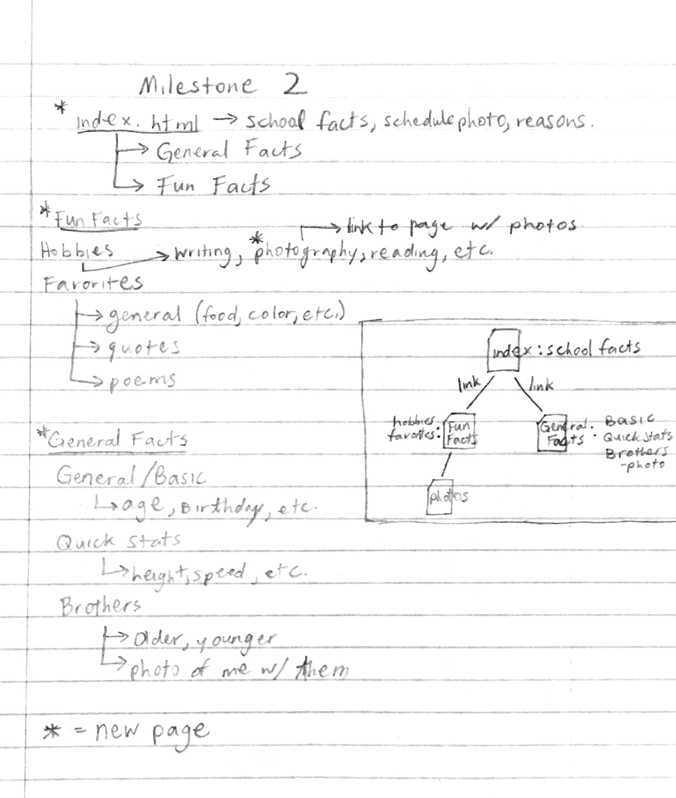
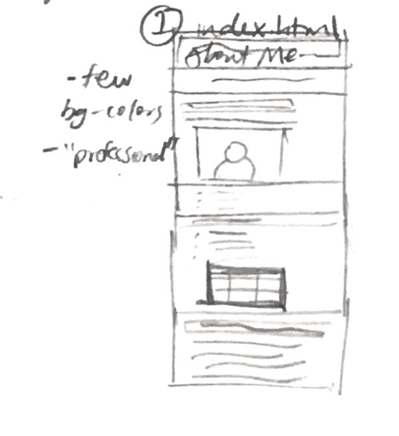
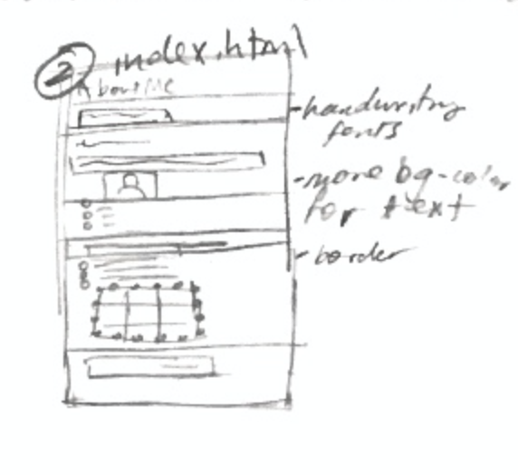
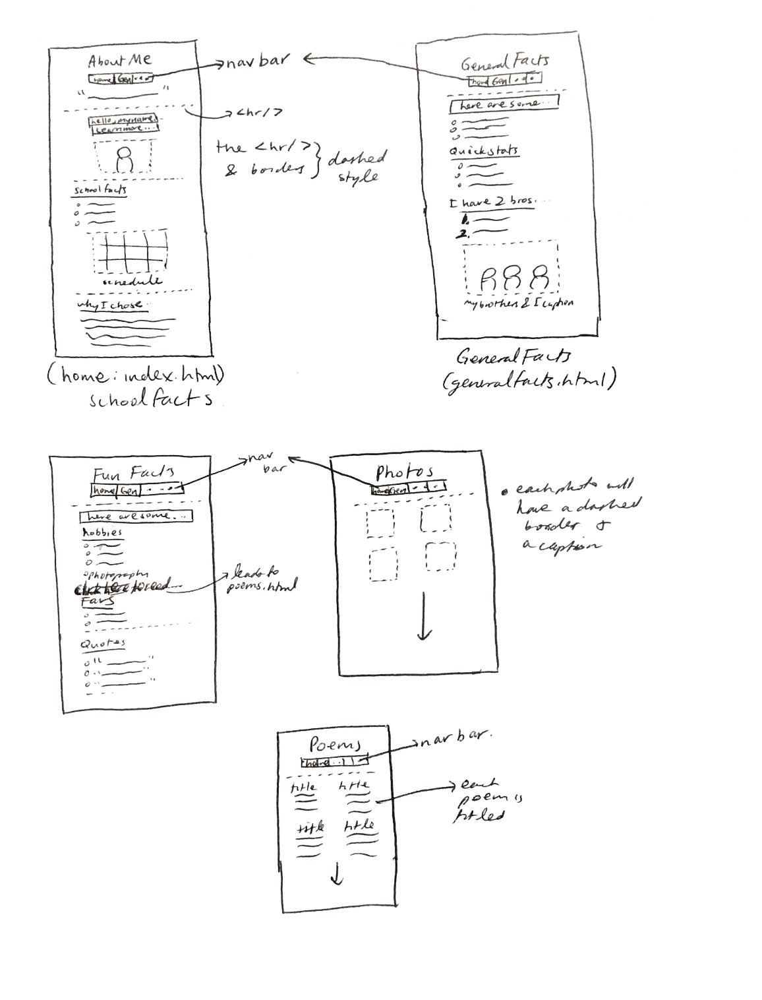

# Project 1 - Design Journey

**For each milestone, complete only the sections that are labeled with that milestone.**

## Markdown Instructions

This is a Markdown file. All written documents that you will submit this semester will be Markdown files. Markdown is a commonly used format by developers and bloggers. It's something that you should know.

The following links are Markdown references:
- <https://guides.github.com/features/mastering-markdown/>
- <https://github.com/adam-p/markdown-here/wiki/Markdown-Cheatsheet>

When writing your Markdown file in Atom. Open the command palette and search for **Markdown Preview: Toggle**. This will open up a panel in Atom where you can preview your formatted Markdown file.

This is how your insert images into your Markdown documents:

## Milestone 1

**Make the case for your decisions using concepts from class, as well as other design principles, theories, examples, and cases from outside of class.**

You can use bullet points and lists, or full paragraphs, or a combo, whichever is appropriate. The writing should be solid draft quality but doesn't have to be fancy.

### Website Topic (Milestone 1)

[Briefly explain what your website will be about.]
* My website will be a general website for others to learn about who I am.

### Target Audience (Milestone 1)

[Briefly explain who the intended target audience(s) is for your website. Be specific and justify why this audience is appropriate for your site's topic.]
* The intended audience for this website will be peers whom I have just met, such as new classmates.
* This audience is appropriate for this topic because it will contain fun facts that may allow the user to learn things about me that may lead to a future friendship.

### Final Content (Milestone 1)

[Briefly describe the content you plan to include in the final site, and why it's the right content for your audiences.]
* Basic information about myself such as my age and birthday.
* Hobbies, favorite things, leisure activities.
* More school related things such as my major/minor and current class schedule.

### Home Page Content (Milestone 1)

[Briefly identify what content you will include on the homepage and why this content should be the first thing your target audience sees when they visit your site.]
* Name: This is because they may not know my name.
* Age and Class Year: This is because they may want to know if we will be graduating the same year.
* Major/Minor: This is because we may have some shared particular interest.
* An image of my current schedule: This because they may want to see if we have any of the same classes.

(Below is the image of my schedule that will be on the home page):

---
## Milestone 2

**Make the case for your decisions using concepts from class, as well as other design principles, theories, examples, and cases from outside of class.**

Each section is probably around 1 reasonably sized paragraph (2-4 sentences).

### Target Audience (Milestone 2)

[A clearer description of audience: who are they, what are they interested in with respect to this site, and what are the design goals for that audience.]

The audience will be people around my age who I do not know yet, and who may be looking for a new friend, whether they are in any of my current classes or not. The design goals are for there to be a main homepage with general school facts about me, and if that seems interesting enough, there will be links to things that might seem more fun to read, like hobbies or favorites.

### Organization & Navigation (Milestone 2)

[A description of how you generated and considered alternatives for the site's content organization and navigation. You are required to include images here of your card sorting for determining the organization of content and the navigation.]

[Thoroughly document this process. The _process_ is the important part of this assignment, not the final result.]
Because this site's content focuses on facts about myself, I considered putting all the main hobbies and favorite things on the homepage. However, I realized that if I just put my school information, like my schedule, major, and graduation year, that would make more sense. This is because if someone wanted to get to know me better, it would make sense to first check if we have any of the same classes or the same major, and if they did, that would mean that we have similar general interests to begin with.

The sorting began with putting the different facts I would have into three categories: School Facts, General Facts, and Fun Facts. The School Facts stayed on the homepage, index.html, as stated above. The General Facts and Fun Facts both got new pages that the homepage was linked to. Then, within the General Facts, I sorted the facts into three more categories: General/Basic, Quick Stats, and Brothers. The General/Basic facts were simpler, like my age and birthday. The Quick Stats were all numbers, and the Brothers category was a description of my older and younger brothers, as well as a photo of me with them. The Fun Facts were sorted into Hobbies and Favorites. Within the Hobbies category, I listed things like writing and reading, but also photography. This photography hobby was actually a link to a new page with some photos I have taken. The Favorites category had categories too: General (food, color, etc.), Quotes, and Poems. These were simply lists of each.

I organized all the content this way to try and make it easy for people who might want to get to know me better. They can pick and choose which things they'd want to learn, without having to scroll for ages looking for only one thing. If they only care about my school facts, they don't even have to click on any links, and can just stay on the homepage. With the General Facts, they can quickly learn simple facts about me, and not have to first read through all my favorite things. With the Fun Facts, they can find most of my interests without being bogged down by anything else.

A diagram of how I planned this organization is below.

### Final Organization and Navigation (Milestone 2)

[Explain how the final organization of content and navigation is appropriate for your target audiences.]

This final organization of content and navigation is appropriate for my target audience because they will easily be able to find out the information they want. For example, if they only wanted to see my hobbies, they could click on the links to that, and not have to read anything else. It won't take much time to find any of the facts they are interested in.

---
## Milestone 3

**Make the case for your decisions using concepts from class, as well as other design principles, theories, examples, and cases from outside of class.**

Remember to focus on the things we can't see just by looking at the site: changes, alternatives considered, processes, and justifications.

Each section is probably around 1 reasonably sized paragraph (2-4 sentences).

### Theme Ideas (Milestone 3)

[Discuss several ideas about styling your site's theme. Explain why the theme ideas are appropriate for your target audiences. Feel free to include some hand-drawn sketches (not digital drawings, not mock-ups, not wireframes, etc.) here to document your design process.]

1) For the first theme, I thought of doing one that was more "professional". It would be a more pastel colored theme, with simpler fonts. The colors would be on the warmer spectrum, so that they seem more welcoming and open. Pastel colors are also very easy to look at, and are not jarring. In the included image, I was trying to design the homepage, which would be the basis for the other sites. It has less of a variety of many different colors, because I wanted it to be a simple theme. I do not want the font to be a serif font either, because that would remind people of school (i.e. Times New Roman), and this website is supposed to be more interesting than a school paper.

2) For the second theme, I wanted to do one that had a lot more character. As seen in the included drawing, it would have many more background colors, and different kinds of fonts and borders. While this one was less "professional", it might be more interesting to look at for young adults like me. The titles will be more fantasy themed, and the other fonts might be handwriting type fonts, or a monospace font, to make it seem like I am talking directly to the audience.

### Theme Design (Milestone 3)

[Discuss your theme designs: how did you come to them, what are their strengths and weaknesses, how do they fit your overall design goals and audiences?]

[Emotion is a big part of design. What emotions where you thinking about or trying to convey in your designs?]

At first, I considered making the homepage (index.html) a little simpler, because it was the school facts page. However, I realized that if this is the homepage, it should be more interesting because this is what was catching the audience's attention. I also realized that even thought I love to use many different colors in whatever I may draw, that would not really work in websites, because if there are way too many different colors, the audience might be less willing to keep reading.
For the first theme, I wanted to make the website seem professional, like I knew what I was doing, but also just interesting enough that even complete strangers would want to keep reading. Because the colors weren't neon, they were easy to look at. The warmer colors are some of my favorite colors, and also happen to convey more welcoming/inviting and cozy feelings. The fonts weren't Times New Roman, but also were not crazy fun fonts. This is because I wanted this theme to be simpler. So, with a font like Verdana, the audience would be able to read it very easily, but would not be bored enough or reminded a lot of school or other textbook readings.
For the second theme, I made the colors darker, because then, all the other background colors would be able to pop more. With all these colors, the site has more character, and the audience might be more interested in what was underneath each heading. Even though there are many more colors, they are all on the cooler spectrum, and are (for the most part) different shades of the same purple or darker blues. This is also a darker colored theme, because since this site is geared towards teenagers like me, they might be looking at this late at night. So, the darker colors would be easier on the eyes if they are in a darker room, or if it is very late. The borders of the photos are dotted, making what is actually inside the image pop even more. The headings are either handwriting fonts like Chalkduster or Bradley Hand, and the main bulk of the words are in Monaco. With these fonts, I can make this site feel less like a school project, and more like a personalized place. It would almost be like I am writing or typing directly to the audience, making it more personal.
I feel like the second theme is a stronger one than the first theme, because it has more character and variety. If this is for a stranger who does not know me, they may need some incentive to stay on this site, and if it is not interesting enough, they would just exit the site. With the different fonts and colors, it will be more eye-catching, and they will want to keep on reading facts.

Below are some quick sketches I did of the two different themes for the homepage. Note the differences in the number of boxes (background-colors for things like h2, etc) as well as the borders.

--
## Final Submission - Rationale

**This rationale should be polished writing: one you might submit as a report to a client or boss to help explain the project and convince them you did a good job. You'll be surprised how much writing and communicating you need to do about projects and choices on internships and jobs; practice that here.**

It should be a comprehensive, complete story of the project. You might find that each section runs a few paragraphs (1-2). Sketches can often help tell the story of your design. Screenshots are also useful for describing issues discovered during the design process and how you addressed them.

Your rationale should be a polished version of the earlier explanations.

### Site Layout (Final Submission)

[Show your design process and final layout for your site. You must include photos of your sketches of the layout. No digital drawings permitted.]

These drawings show the final layout of the website. There is a main title, with the navigation bar beneath it, with the main content separated by both hr elements and subheadings. The navigation bar was reorganized from just being a list of the links after the header to a more horizontal layout towards the top, which is more convenient for users.

### Audience (Final Submission)

[A complete and polished description of the intended audience(s) for your website.]

The intended audience for this website are people who might want to be friends, and are potentially in my classes. This site was designed so that people can get to know me better, as well as much quicker than it would ordinarily take. For example, normally, it might take even 3 different conversations to learn these facts about me, and even then, we might not even get around to get to some of these facts.
However, with this site, the audience will be able to learn straight from the homepage everything there is to know about my major, minor, and reasoning. They can learn very general facts about me, as well as fun facts, and even get to see some of the photos or poetry I have taken/written. They can learn all this about me with just a few clicks.

### Design Goals (Final Submission)

[An explanation of the design goals for that audience, based on your earlier rationales.]

The design goals for the audience was to create a simple website that would give them the information they are looking for in an efficient manner, while also looking appealing and fun. Since this might be for people my age, I wanted to make it have a cleaner look, with a general simple color scheme. This way, it would not seem very cluttered and annoying.
I wanted to create something that they would enjoy looking at, so if they clicked on it quickly, they would continue to read about my different facts, and not immediately be turned away simply because it was confusing or too jarring.

### Navigation (Final Submission)

[An explanation of how the final navigation met your goals and why its appropriate for your audience(s).]

The navigation goals were to make it so that the audience could click on what they want, and learn only about those facts on their respective pages. They would not have to scroll through things they are not interested in just to get to what they want.
The navigation in my site reaches those goals because the navigation bar was placed at the very top, so they wouldn't have to scroll far to get to it. Each page of the site is on the navigation bar, and I believe that the titles of each page are very explanatory with what is on them.

### Organization (Final Submission)

[An explanation of how the final organization met your goals and why its appropriate for your audience(s).]

The organization for this was to have all the main content in the middle, with the links for other pages at the very top. Because the website is essentially different facts about me, I technically could have put all of them on the same page. However, this would be hard for users, because they would just have a single very long website. Organizing the content into the links was good because they won't have to do that.
Each page has the same h1 element header at the top, in the same colors, to show the audience what that respective page will mainly be about. Likewise, each subheading in the pages are underlined and purple, because the page layouts should be at least roughly the same for each. The only pages that might have been structured different was the photos.html page and the poems.html page. In the photos and the poems pages, the title and the navigation bar at the top are the same, but the main content is different. With the photos, there is no text other than the image captions, so the photos are the main content and they are organized in rows. With the poems, it was essentially the same as the photos, except images were replaced with poems that I'd written.

### Visual Design (Final Submission)

[An explanation of how the final design met your goals and why its appropriate for your audience(s).]

The goal for the visual design was to design something easy for my audience, people around my age, to look at. This is why darker colors were used, because if they are around my age, they may be using their laptops late at night, and using bright colors like whites or yellows could be very jarring and hurt their eyes. But, with darker or more muted colors like deep purples, greens and grays, they can continue to use the website whenever they want.
The use of all the purples, besides it being one of my favorite colors, can also create a mood of curiosity and fascination, as well as stimulate the imagination (according to https://www.verywellmind.com/the-color-psychology-of-purple-2795820). This was perfect, because the audience could learn some of my favorite color schemes, as well as continue to read through the site with at least a little bit of curiosity. I also wanted to create a very open and welcoming site, hence the green text and the open-circle styled bullets. With the green, users can see that I am not a one-dimensional person with the same colors just in different hues. Green also is a color that traditionally goes well with purple.
I also wanted to create a site that was fun, and didn't remind the users of normal school websites or textbooks. The open-circle styled bullets make the site seem less strict, because they fulfill the same function as normal bullets, but have a bit more character and flair. The different fonts also help with this mood, because they are not serif fonts, which are normally used for school essays. If the font was something like Times New Roman, the users might become bored immediately upon looking at the site, and not want to continue. But when they see a fun font, they can see that this site isn't as school-related as they might think it was. The use of a more handwriting font, like for the headers, creates a more "homemade" environment, and can almost seem like I, the creator of the website, am writing directly to the users. The use of a more typeface font for the parts of the site with a lot of text can make it seem like I am typing directly to the users. It creates a more personable and welcoming feeling for those who might be looking at the site.

### Self-Reflection (Final Submission)

[What did you learn from this assignment? What are some of your strengths and weaknesses?]

From this assignment, I learned how much one could accomplish with basic HTML and CSS knowledge. I was able to create a site that was pleasing to look at, with interesting facts about me that people can use to get to know me a bit better. I also learned that the target audience is especially important, because at first, I think I was trying to design a website that I would like, without thinking of the users. However, as I kept working on this assignment, I slowly started to realize that even if I didn't want to use specific colors (like the darker greens), it would look better and be more eye-catching for the audience who uses this site.
I think that some of my strengths are being able to separate the content by their different pages, as well as adding parts of myself to the site with little things like the font choice and colors.
Weaknesses I had during this assignment was the layout. I had trouble deciding where the navigation bar would be, as well as how exactly to code the CSS to get it to be where I wanted. The same thing happened on the photos.html and poems.html pages, because I had trouble getting the images/poems to be in their own rows, instead of all being stacked on top of each other.
