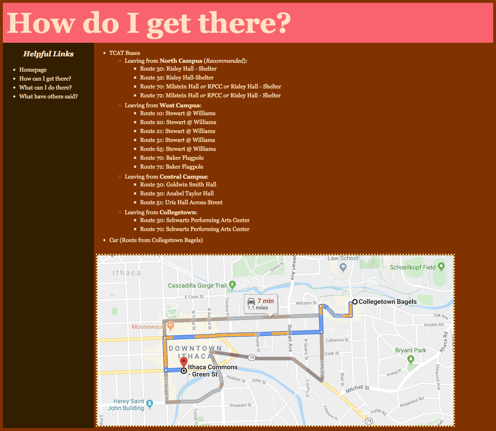
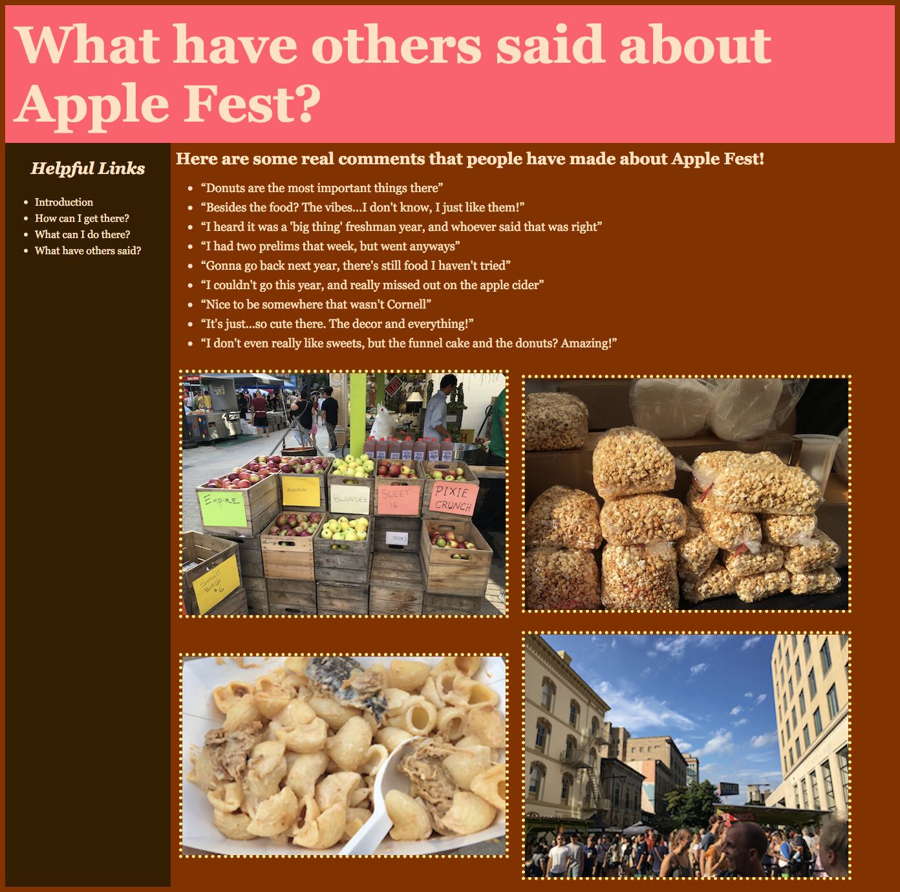

# Project 2 - Design Journey

**Be clear and concise in your writing.**

_Bullets points are acceptable._

## Planning & Design

### Target Audience (Milestone 1)
[Clearly explain who is your target audience.]

The target audience is students at Cornell who need a place to escape from the stressfulness of school to just relax and eat good food.

### Discovering your Users' Needs (Milestone 1)
[You'll need to discover your users' needs. Talk to them! Document what you've learned about them. When talking to your users, take notes and include those notes here.]

### Needs (Milestone 1)
[Analyze your target audience's needs and wants from your notes above. List each need/want below. There is no specific number of needs required for this, but you need enough to do the job.]

- Need/Want #1: Good Food (and meals)
  - **Needs and Wants**
    - [What does your client and audience need and want?]

        They seem to want good food that they can't normally get at Cornell, or even just generally a good lunch.

  - **Design Ideas and Choices**
    - [How will you meet those needs and wants?]

        I will put pictures of many of the foods that they can get there, so that they can see what options they might want.

  - **Rationale & Additional Notes**
    - [Justify your decisions; additional notes.]

        This is good because if they see pictures of the food they can get there, instead of just the words, they will be able to easily identify the food. Pictures also usually speak louder than words.

- Need/Want #2: Apple Cider Donuts
  - **Needs and Wants**
    - [What does your client and audience need and want?]

        Most people I have spoken to said that they either went back to AppleFest because of the cider donuts, or they went in the first place because of the cider donuts.

  - **Design Ideas and Choices**
    - [How will you meet those needs and wants?]

        I will put pictures of the most popular cider donut stand, the one at the entrance, as well as explain how the lines are and where this is located.

  - **Rationale & Additional Notes**
    - [Justify your decisions; additional notes.]

        This is good because they will be able to easily identify the booth they can buy these popular donuts at, and with the explanation of the lines, they can determine for themselves whether it is worth it to get the donuts or not.

- Need/Want #3: Nice atmosphere/friendly vibes
  - **Needs and Wants**
    - [What does your client and audience need and want?]

        They want a place that is more easygoing and different from the hectic lifestyle at Cornell, with nice decor and a chill atmosphere.

  - **Design Ideas and Choices**
    - [How will you meet those needs and wants?]

        I will put pictures of the general atmosphere, as well as include quotes that the people who have gone before have said about the relaxing vibes they get and how much they love it there.

  - **Rationale & Additional Notes**
    - [Justify your decisions; additional notes.]

        This is good because with actual quotes, they can see how genuine the feel of the festival is, more than just me explaining that it's fun.

- Need/Want #4: Escape from stress of Cornell

  - **Needs and Wants**
    - [What does your client and audience need and want?]

      They want to have a fun weekend activity to do that does not have to do with Cornell, and where they do not have to worry about studying and can just hang out with friends, especially because AppleFest is usually during prelim season.

  - **Design Ideas and Choices**
    - [How will you meet those needs and wants?]

      I will put pictures and include quotes, like what I did for Need/Want 3. I believe that these two wants are very similar. But, they are different because with this, I think that the quotes will be more helpful than the pictures, because the atmosphere is related to the decor of the festival while an escape can just be hanging out with friends anywhere.

  - **Rationale & Additional Notes**
    - [Justify your decisions; additional notes.]

      This is good because it is very similar to Need/Want 3, with the addition of extra emphasis on the quotes.

- Need/Want #5: A reliable way to get there
  - **Needs and Wants**
    - [What does your client and audience need and want?]

        They need a good way to get to Apple Fest in the first place, whether that be by walking, bus, or car.

  - **Design Ideas and Choices**
    - [How will you meet those needs and wants?]

        I will include a list of all the way someone can get to the Commons, as well as the general time each would take to get there. There will also be a map for those who might want to drive or walk there. For the ones who want to take a bus, I can emphasize the fact that when buses were taken from North Campus, they tended to be less crowded and full.
  - **Rationale & Additional Notes**

    - [Justify your decisions; additional notes.]

        This is good because they can have multiple options, and can choose for themselves which way would be best for them, depending on how they feel.

### Design Process (Milestone 1)
[Document your design process. Show us your card sorting. Describe your theme. Show us sketches of your site (mobile and desktop versions). etc. You should show us how your came up with your design and how your iterated on that design; show us the evolution of your design.]

The theme will be using Fall colors, because AppleFest is an event that is only held in the Fall here. The saturation of the colors will be a bit lower, because I want to make the website seem very natural and genuine, and not artificial. I tried card sorting in four different ways: needs/wants, foods/vibes, sweets/savory/drinks, and "necessary"/"optional". I think that for this website, the sorts of needs/wants as well as "necessary"/"optional" will be most beneficial.
For the Desktop design, I made the content go across the page horizontally, because computer screens are wider. The navigation bar will be on the side, so that it doesn't take away from the main content. Originally, the Dates and Times were going to be on a separate page that the users had to click on to get to, but then I realized that they should probably be on the homepage, because that is important information. I also decided that the pictures should be lined up, so that the eye can be guided from each picture to their respective captions or other paragraphs very easily.
For the Mobile design, I made the content more vertically aligned. I was going to keep the design more consistent and have the navigation bar go on the side, like the Desktop design, but then that would be hard for phones. The navigation bar will instead go at the top, underneath the headings for the pages, because if it was on the side, the main content would have to be sized smaller, and that is hard on a mobile device. The pictures, instead of being aligned horizontally with rows, will be in columns, and might even be just one picture per "row", because this is skinnier. It is easier to scroll down on a phone than sideways.

### Final Design (Milestone 1)
[Include the final sketches for each of your pages. These sketches **must** be done on paper.]

**Desktop Design:**

**Mobile Design:**

### Design Rationale (Milestone 1)
[Explain why your design is appropriate for your target audience. Specially, why does your content organization, navigation, and site design/layout meet the needs of your users?]

The design is appropriate for the target audience because all the pictures will exemplify the relaxation and fun someone can have at AppleFest much better than words will. The colors will also make the website seem very warm. With the different pages, users can very easily find necessary information, like bus routes or directions, and separate that type of information from all the things they can do at AppleFest. The page where I quote what people have said about AppleFest shows more authenticity to the site. These all satisfy the needs/wants of the users because if they need to get to AppleFest, they have a page for that, but if they just want to see the general atmosphere as well as the food they can get, there is also a page for that.

### Responsive Design Considerations (Milestone 1)
[Explain how you adapted your design to be responsive (support both mobile and desktop versions).]

I changed the design for the desktop and the mobile sites by changing the general layout. The desktop design is more horizontal, and spans across the entire page. The navigation bar is on the side, and the longer blocks of text might be on the side of the pictures as well as the bottom. However, for the mobile design, it is very much vertical. The navigation bar is on the top, beneath the heading, so that users won't have to scroll to the side, because that is always harder on phones. The pictures will be in one column scrolling downwards, or even with two in each row, so that they can scroll sideways as little as possible. The larger blocks of text will also be beneath the pictures for this same reason.

### Additional Design Justifications (Milestone 1)
[If you feel like you haven’t fully explained your design choices, or you want to explain some functions in your site (e.g., if you feel like you make a special design choice which might not meet P2M1 requirement), you can use the additional design justifications to justify your design choices. Remember, this is place for you to justify your design choices which you haven’t covered in Milestone 1. Use it wisely. However, you don’t need to fill out this section if you think all design choices have been well explained in the design journey for Milestone 1.]

---

## User Testing (Round 1)

### Coded Draft Desktop Website (Milestone 2)
[Include screenshots of the draft version of your desktop design. Include a screenshot for every page. If you're using Firefox, click the 3 dot button in the address bar and select "Take a Screenshot."]

### User Testing Plan (Milestone 2)
[Plan out your tasks for Milestone 2 here before doing your user testing. These must be actual user testing tasks. Tasks are not questions!]

1. Find out if you would be able to attend Apple Fest if it was September.

2. Find the general opinion on the donuts.

3. Look for a way to get to Apple Fest that would be the easiest for you.

### User 1 - Testing Notes (Milestone 2)
[When conducting user testing, you should take notes during the test. Place your notes here. These really should be hand written, so take a photo of them. Typing notes while conducting testing can distract your user and should really be avoided.]

### User 1 (Milestone 2)
[Using your notes from above, describe your user 1 by answering the questions below.]

1. Who is your user 1, e.g., where user 1 comes from, what is your user 1’s job, characteristics, etc.?

User 1 is my roommate, and she comes from Long Island, New York. She is currently a premed student at Cornell. Because of this, she often has much more work to do than me, including going to the lab for 12 hours a week, and other things like this.
She likes food, more specifically sweets, and, like me, can be lazy at times, especially when we have finished the majority of our homework for the next day.  

2. Does your user 1 belong to your target audience of the site? (Yes / No)

Yes, user 1 belongs to the target audience, because she likes good food, and I'd imagine that with all the work she has, would very much enjoy a place away from the stressfulness of Cornell and all her classes.

[If “No”, what’s your strategy of associating the user test results to your target audience’s needs and wants? How can your re-design choices based on the user tests make a better fit for the target audience?]

### Tasks for User 1 (Milestone 2)
[Test each task, with each user.]

[Report the results for your user's performance on each of your tasks. You should **describe the task** you asked the user to complete, explain **what the user did**, describe the user's **reaction/feedback** to the design, **reflect on the user's performance**, determine what **re-design choices** you will make. You can also add any additional comments. See the example design journey for an example of what this would look like.]

- Task #1
  - **Task Description**
    - Find out if you would be able to attend Apple Fest if it was September.
  - **How did the user do? Did that meet your expectation?**
    - The user was able to complete this task in almost no time at all, which met my expectations.
  - **User’s reaction / feedback to the design** (e.g., specific problems or issues found in the tasks)
    - The user almost laughed because they felt that this task was extremely obvious, and simply pointed to the top of the homepage and said that they would be able to go.
  - **Your reflections about the user’s performance to the task**
    - I think that the user was able to find this very easily, due to it being one of the first things on the homepage. The way that she smiled upon finding it showed me that it must have been very obvious to find, so I think that the dates and time were in a good place. Maybe this task was a little easy.
  - **Re-design choices**
    - I think that the dates were in a very good spot, at the top of the first page. Maybe a good decision could be to underline the actual dates (i.e. 9/27), so that all the different elements for each day was more separated.
  - **Additional Notes**
    - [Justify your decisions; additional notes.]

- Task #2
  - **Task Description**
    - Find the general opinion on the donuts.
  - **How did the user do? Did that meet your expectation?**
    - The user was able to complete this task in a longer time than task 1, which also met my expectations.
  - **User’s reaction / feedback to the design** (e.g., specific problems or issues found in the tasks)
    - The user scrolled down on the homepage first, before realizing that the links were on the side. After seeing this, she seemed to understand which link would lead to this answer and clicked on the correct one before responding that the food seemed to be good according to others.
  - **Your reflections about the user’s performance to the task**
    - I think that she was able to complete this task easily only after seeing all the links, but after clicking on the link, answered very quickly. Her answer was very simple as well, and I wasn't sure if that meant that the task wasn't a good one, or if the answer wasn't clear enough.
  - **Re-design choices**
    - I think that because she didn't notice the links were there at first, I should make it more obvious that they are links, by underlining them, and even bolding and making the "Helpful Links" bigger. I also think that maybe the homepage name of that respective link can be more specific.
  - **Additional Notes**
    - Afterwards, however, she clicked on the homepage, and then clicked on homepage again because I think that maybe it wasn't very clear what exactly the homepage was.

- Task #3
  - **Task Description**
    - Look for a way to get to Apple Fest that would be the easiest for you.
  - **How did the user do? Did that meet your expectation?**
    - The user was able to complete this task slower than task 1, but quicker than task 2, meeting my expectations.
  - **User’s reaction / feedback to the design** (e.g., specific problems or issues found in the tasks)
    - The user started from the homepage, and then immediately clicked on the right link to find out the easiest route for her. However, she did seem a little but overwhelmed with all of the words at first. She used her finger to keep her place as she looked only for the Collegetown routes, and was able to find it.
  - **Your reflections about the user’s performance to the task**
    - I think that because she seemed overwhelmed a bit by all of the sudden words, in addition to having to read through all the different routes, it took her longer than task 1. Regardless, she was able to find that Route 30 from Schwartz Performing Arts Center would be best, but replied with location (the Center) instead of the route number, which surprised me.
  - **Re-design choices**
    - I think that the routes pages could be organized a little better, because right now, it was hard to read through, especially with all the words. I also think that I will change the format of the different routes, and put the location of the stops before the number.
  - **Additional Notes**
    - [Justify your decisions; additional notes.]

### User 2 - Testing Notes (Milestone 2)
[User testing notes for user 2.]

### User 2 (Milestone 2)
[Describe your user 2 by answering the questions below.]

1. Who is your user 2, e.g., where user 2 comes from, what is your user 2’s job, characteristics, etc.?

User 2 was user 1's friend, and is from Saudi Arabia. She, like user 1, is a premed student. However, she seems to handle the workload a little better and sometimes appears to have more free time than user 1. She likes all foods, and has an affinity for apples.

2. Does your user 2 belong to your target audience of the site? (Yes / No)
Yes, user 2 belongs to the target audience.

[If “No”, what’s your strategy of associating the user test results to your target audience’s needs and wants? How can your re-design choices based on the user tests make a better fit for the target audience?]

### Tasks for User 2 (Milestone 2)
[Report the results for your user's performance on each of your tasks. The format for this section is the same as the "Tasks for User 1" section above.]

- Task #1
  - **Task Description**
    - Find out if you would be able to attend Apple Fest if it was September.
  - **How did the user do? Did that meet your expectation?**
    - The user was able to complete this task very easily, meeting my expectations.
  - **User’s reaction / feedback to the design** (e.g., specific problems or issues found in the tasks)
    - The user looked at the dates immediately, and stated that she would be able to go on the Saturday date, which was more specific than user 1. She found it very easily and quickly.
  - **Your reflections about the user’s performance to the task**
    - I think that the user completed this task with great ease, and even mentioned the specific day that she would go to Apple Fest, which was more information than I'd asked for. I think that this means that she was able to read the dates in an organized manner and figure out if she could attend.
  - **Re-design choices**
    - From user 1's reaction, I would re-design the dates to look more organized. I think that even if user 2 seemed to find the dates to be fine, I would still do this just so that the times can be easier to read.  
  - **Additional Notes**
    - [Justify your decisions; additional notes.]

- Task #2
  - **Task Description**
    - Find the general opinion on the donuts.
  - **How did the user do? Did that meet your expectation?**
    - The user was able to complete this task about the same as user 1, meeting my expectations.
  - **User’s reaction / feedback to the design** (e.g., specific problems or issues found in the tasks)
    - The user scrolled down on the homepage first,  and then found the links. Then, she hovered over the "what can I do there" link, but didn't click on it. Finally, she clicked on the correct one, and answered that the food seems to be good at Apple Fest, especially the donuts.
  - **Your reflections about the user’s performance to the task**
    - She did the same thing that user 1 did, where she scrolled downwards on the homepage first. I think that when she was hovering over the "What can I do there" link, it was because she might have been thinking that she might find opinions there. But, after reading the next link she realized that that would definitely have the opinions there. That order of thought made sense.
  - **Re-design choices**
    - I think that maybe the homepage could be redesigned in a way to show that there would literally be nothing else on the homepage besides the brief explanation, the dates, and some photos. Maybe I can add a sentence at the bottom saying something like "Click on the other links to find out more".
  - **Additional Notes**
    - [Justify your decisions; additional notes.]

- Task #3
  - **Task Description**
    - Look for a way to get to Apple Fest that would be the easiest for you.
  - **How did the user do? Did that meet your expectation?**
    - The user was able to complete this very easily, which met my expectations.
  - **User’s reaction / feedback to the design** (e.g., specific problems or issues found in the tasks)
    - The user clicked on the correct link on her first try, and seemed to skim through all of the other options before finally landing on the one that would be best for her, which was Route 30. Much like user 1, she answered with the name of the location of the stop, and not the number.
  - **Your reflections about the user’s performance to the task**
    - I think that both she, and user 1, answered with the location of the stop and not the number because they would be looking for the place that is closest to them. I found it interesting that they both answered this way. She seemed to skim all the rest of the words first, and I think that that may be a design flaw and not a problem with the task, even if she found it fairly easily.
  - **Re-design choices**
    - I think that the routes page can be more clearly divided in terms of the locations of the bus stops, like whether it would be departing from North Campus or not. This can be done by putting them in a more "table" like style, instead of just a long list. I also think that the locations of the stops can come before the numbers, because that is what the users would be looking for.

### Additional Design Justifications (Milestone 2)
[If you feel like you haven’t fully explained your design choices in the design journey for Milestone 2, or you want to explain some functions in your site (e.g., if you feel like you make a special design choice which might not meet P2M2 requirement), you can use the additional design justifications to justify your design choices. Remember, this is place for you to justify your design choices which you haven’t covered in Milestone 2. Use it wisely. However, you don’t need to fill out this section if you think all design choices have been well explained in the design journey for Milestone 2.]

---

## User Testing (Round 2)

### Finished Desktop & Mobile Website (Final Submission)
[Include screenshots of both the desktop and mobile version of your site that you will be using for user testing.]

Desktop Version

Mobile Version

### Task Planning (Final Submission)
[Plan out your tasks for the Final Submission here before doing your user testing. These should probably be the same as your tasks from Milestone 2, unless you are changing them to address problems with your tasks that you discovered in the first user test.]

1. You are hungry, so you decide to head to AppleFest to eat things there. Find some things there that you would want to eat/drink.

2. You have the entire afternoon free for AppleFest, and you want to spend as much time as possible away from campus. Look for things to do there that would give you enough time to relax before heading back to Cornell.

3. You just finished your first prelim this past week, and you want to go relax at AppleFest, but you're tired. Find a way to get to the Commons.

### User 3 - Testing Notes (Final Submission)
[User testing notes for user 3.]

(the first user for the final milestone)

### User 3 (Final Submission)
[Describe your user 3 by answering the questions below.]

1. Who is your user 3, e.g., where user 3 comes from, what is your user 3’s job, characteristics, etc.?
User 3 is a friend from Long Island who also goes to Cornell. She is in the Arts and Sciences college and is a premed student who enjoys eating good food. We were able to meet so she could be a test user because she didn't have any prelims this week, and so, was more free than other weeks. She is a very amicable and sociable person.

2. Does your user 3 belong to your target audience of the site? (Yes / No)

Yes, user 3 belongs to the target audience because she likes food and seemed like she had a lot of prelims because this was the one week she could meet.

[If “No”, what’s your strategy of associating the user test results to your target audience’s needs and wants? How can your re-design choices based on the user tests make a better fit for the target audience?]

### Tasks for User 3 (Final Submission)
[Report the results for your user's performance on each of your tasks]

- Task #1
  - **Task Description**
    - You are hungry, so you decide to head to AppleFest to eat things there. Find some things there that you would want to eat/drink.
  - **How did the user do? Did that meet your expectation?**
    - She was able to successfully complete this task, in a fairly short amount of time. She clicked on the "what can I do there" page first, and scrolled down, before answering that she would eat the mac and cheese, donuts, and popcorn. She also seemed to look at the pictures and read the words as an afterthought.
  - **User’s reaction / feedback to the design** (e.g., specific problems or issues found in the tasks)
    - She seemed to think that the design was good, and compared to the last milestone, the links seemed to be more obvious, because instead of scrolling down on the homepage, she clicked immediately on the correct link to find the answers. However, she did take a little bit of time to answer, and this may have been because she was looking at the pictures and not reading the words as much.
  - **Your reflections about the user’s performance to the task**
    - I think that she did this task very well, even if she took a little bit of time to answer. I don't think that the time it took her to answer was very important, because she was looking at the pictures, and was able to answer from them. I found it very interesting that she was basing her decision on the pictures, but I also wasn't very surprised because I think that I would do the same thing. The pictures made the food seem more genuine than just reading a sentence on them.  I thought that she would have checked out the "what have others said" page, but she didn't, and I don't think this mattered because the answers were just as easily on both pages.
  - **Re-design choices**
    - A re-design choice I would make would be to maybe group the photos together better, because in the "what can I do there" page, the first two images were a mix of food and a food stand, and the second two were the same. Perhaps it would have been good to put the food together, and the non-food together.
  - **Additional Notes**
    - [Justify your decisions; additional notes.]

- Task #2
  - **Task Description**
    - You have the entire afternoon free for AppleFest, and you want to spend as much time as possible away from campus. Look for things to do there that would give you enough time to relax before heading back to Cornell.
  - **How did the user do? Did that meet your expectation?**
    - The user was able to complete this task successfully as well, which met my expectations. She stayed on the same page, the "what can I do there" page, and scrolled to the bottom to see what else there was to do besides eat. She mentioned the live performances, and said that she'd also eat dinner there or go shopping, and more specifically, thrifting. Then, she scrolled up to the top of the page again, and read the line directly "sit and soak in the atmosphere".
  - **User’s reaction / feedback to the design** (e.g., specific problems or issues found in the tasks)
    - She seemed to think that this task was very easy, especially because she found that she didn't particularly need to change to another page to find the answer, and could just scroll down. She did not mention any specific problems or issues with this task.
  - **Your reflections about the user’s performance to the task**
    - I think she performed this task very well, and it was done even quicker than task 1, because she could stay on the same page, and just read off from either the words or the captions on the picture. She did both, actually, and mentioned the live performances from the image, and the shopping and dinner from the paragraph at the bottom, which was what I expected.
  - **Re-design choices**
    - A re-design choice that I would make would possibly be to add a little bit more information on the other shopping places or restaurants/dinner places to go to in the Commons, because she didn't mention any specific place there, and only said that she would "Eat dinner". Even if she mentioned thrifting, I don't think that I would only list thrifting stores to go to because this would not be for all the users, and only catered towards this one user.
  - **Additional Notes**
    - [Justify your decisions; additional notes.]

- Task #3
  - **Task Description**
    - You just finished your first prelim, and you want to go relax at AppleFest, but you're tired and you don't have a car. Find a bus route that would get you to the Commons.
  - **How did the user do? Did that meet your expectation?**
    - The user did well, which met my expectations. She clicked on the correct link immediately, the "how can I get there" page. Then, she scrolled past the bus routes, and landed on the car option. She said that she had a car, so if she was tired as the task said, she would drive there, because it would be easier and less hectic than a bus. Then, she noted that the starting location of Collegetown Bagels would work well for her.
  - **User’s reaction / feedback to the design** (e.g., specific problems or issues found in the tasks)
    - She didn't seem to have any specific problems with the design, nor the task, and was able to complete it very quickly and without much difficulty at all. She *did* have to scroll past all the bus routes first, but her reaction to that was just to scroll past them quickly to get to the information she needed the fastest.
  - **Your reflections about the user’s performance to the task**
    - I think that she performed this task very well. She performed it very efficiently and without any trouble, which was expected because this task was more straightforward than the others. I thought that it was reassuring for her to say that Collegetown Bagels was a good starting point for her, because I had some trouble finding a good place for the routes to start to get to the Commons.
  - **Re-design choices**
    - A re-design choice I think might be to perhaps add extra lines separating the car and walking choices from the bus routes, but I don't think that this is necessarily needed, because she seemed to see the divisions between the different ways to get to the Commons were obvious.
  - **Additional Notes**
    - [Justify your decisions; additional notes.]

### User 4 - Testing Notes (Final Submission)
[User testing notes for user 4.]

(the second user for the final milestone)

### User 4 (Final Submission)
[In this part, describe your user 4 by answering the questions below.]
1. Who is your user 4, e.g., where user 4 comes from, what is your user 4’s job, characteristics, etc.?
User 4 was my roommate for last year, but I chose her because I remember that she went to AppleFest last year while I wasn't able to go, and that she enjoyed it immensely. She is in the College of Engineering, and to me, always seems to be swamped with work, much like a premed major. She is a diligent and hard worker, but also seems to be tired a lot of the time.

2. Does your user 4 belong to your target audience of the site? (Yes / No)
Yes, user 4 belongs to the target audience because she likes food and seemed to be stressed.

[If “No”, what’s your strategy of associating the user test results to your target audience’s needs and wants? How can your re-design choices based on the user tests make a better fit for the target audience?]

### Tasks for User 4 (Final Submission)
[Report the results for your user's performance on each of your tasks. The format for this section is the same as the "Tasks for Users 1 & 3" section above.]

- Task #1
  - **Task Description**
    - You are hungry, so you decide to head to AppleFest to eat things there. Find some things there that you would want to eat/drink.
  - **How did the user do? Did that meet your expectation?**
    - She first scrolled down on the homepage, before finally clicking on the correct link on the sidebar, the "what can I do there" page. After she got to that page, she highlighted the line "Some notable things to try include: apple cider donuts, buffalo chicken mac and cheese, and apple cider", and then answered the question reading off of this, by saying that she would eat the donuts, mac and cheese, and the cider. This met my expectations.
  - **User’s reaction / feedback to the design** (e.g., specific problems or issues found in the tasks)
    - She noted that there were "a lot of pictures" after completing the task, but other than this, her only reaction was to complete the task without any difficulties. She did scroll down on the homepage first, but I believe that she might have done this only to see the picture that was not completely revealed at the bottom of the page.
  - **Your reflections about the user’s performance to the task**
    - I think that she performed this task well, even if she didn't immediately click on the correct link at first, because right after that, she was able to find the correct link, and I don't think she scrolled down on the homepage because she thought the answer was there. I think she did that only because she might have been interested. Other than this, I think her reactions to the task were normal.
  - **Re-design choices**
    - I don't believe that I would re-design anything solely based on this user's reaction and performance of this task, because she was able to do things quickly and efficiently.
  - **Additional Notes**
    - [Justify your decisions; additional notes.]

- Task #2
  - **Task Description**
    - You have the entire afternoon free for AppleFest, and you want to spend as much time as possible away from campus. Look for things to do there that would give you enough time to relax before heading back to Cornell.
  - **How did the user do? Did that meet your expectation?**
    - The user stayed on the same page, and pointed the cursor to the live performances. Then, she looked at the paragraph below and said that she would go shopping, and then eat dinner. She said that she would eat dinner at Luna's, because she likes "the taco salad" there. She seemed excited about the dinner. This met my expectations.
  - **User’s reaction / feedback to the design** (e.g., specific problems or issues found in the tasks)
    - Her reaction to the design was to scroll down on the same page to find the information she needed, and looking at the picture for the live performance first. Upon reading the last paragraph about dinner, she seemed excited about that, because she enjoys eating dinner in the Commons, especially at Luna's.
  - **Your reflections about the user’s performance to the task**
    - I think that she performed the task very well, and was slightly surprised that she got excited about eating dinner there too. I think that this was because even if she had eaten at AppleFest, it would make sense for her to stay in the Commons if it was around dinnertime, so that she could continue to eat good food that wasn't on campus.
  - **Re-design choices**
    - A re-design choice would be to possibly list some of the restaurants that one could eat at when they were at the Commons, such as Luna's. This way, if they didn't know that Luna's was an option, they could go and check it out.
  - **Additional Notes**
    - [Justify your decisions; additional notes.]

- Task #3
  - **Task Description**
    - You just finished your first prelim, and you want to go relax at AppleFest, but you're tired and you don't have a car. Find a bus route that would get you to the Commons.
  - **How did the user do? Did that meet your expectation?**
    - She clicked on the correct link first, the "how can I get there" page, and stated that she would be leaving from West Campus, because she lives there. Her answer was that she would take the bus, and then started to look at the specific routes. She settled on Route 70, because she said that this route 70 was her "default route". This met my expectations.
  - **User’s reaction / feedback to the design** (e.g., specific problems or issues found in the tasks)
    - She seemed glad to see that West Campus was one of the options, and then, after seeing route 70, was satisfied because she was familiar with this route. She found this specific route after skimming through all the other ones from West, and was able to read it directly.
  - **Your reflections about the user’s performance to the task**
    - I found it slightly surprising that she said the route number and not the location, because the other two users who would use the bus did not do this. But, because she said that this was her "default route", perhaps she was used to saying the number instead of the stop, because she uses this route so much. I think that she performed this task very well.
  - **Re-design choices**
    - A re-design choice might be to put the last two routes listed for West, Routes 70 and 72, at the top, even if then, this list wouldn't be in numerical order. This is because the other stops were "Stewart @ Williams", and 70 and 72 were "Baker Flagpole", and I believe, both based on this user, and my own experiences, that Baker Flagpole is a much more recognizable stop.
  - **Additional Notes**
    - [Justify your decisions; additional notes.]

### Additional Users...
[If you conduct more user tests of your website, copy the sections "User 4" and "Tasks for User 4" to make sections for User 5, User 6, etc. You are not *required* to conduct these additional tests, but you might find them helpful for refining your website.]

### Additional Design Justifications (Final Submission)
[If you feel like you haven’t fully explained your design choices in the final submission, or you want to explain some functions in your site (e.g., if you feel like you make a special design choice which might not meet P2 Final requirement), you can use the additional design justifications to justify your design choices. Remember, this is place for you to justify your design choices which you haven’t covered in the design journey. Use it wisely. However, you don’t need to fill out this section if you think all design choices have been well explained in the final submission design journey.]

In Milestone 2, I stated that I would perhaps change the "How do I get there" page so that the locations of the stops would come before the route number, because the users both stated the location of the stop and not the number. However, I decided not to do this, because when the locations of the stops were put before the number, the list seemed harder to read, due to it being less cohesive. With all the route numbers first, it looks more organized. So, I decided to further emphasize the Campus that the buses would be leaving from, by underlining them.

## Self-Reflection (Final Submission)
[This was the first project in this class where you were able to follow a human-centered design process from start to finish. What did you learn from this experience?]

Originally, I thought that the user testing would kind of be very obvious or silly, because if you give them all the same tasks, I thought that they would just do it the same way. However, after this project, I learned that even if the users all accomplished the tasks like I thought they would, the way that they did each one actually gave very insightful notes. For example, some of the users might scroll down first, while others might click on another link first. These both were helpful in making the design of the website more usable for them.
I also learned that responsiveness as more than just making the mobile design, and more than just making the images be more vertical. There is also responsiveness that needs to happen in between, and these designs don't need to be the same as the mobile one. So, while the mobile one could have the sidebar on the top, one of the designs in between can just have the pictures smaller, with the sidebar still on the side. The fonts could also be different sizes, getting smaller and smaller as the screen gets smaller and smaller.

[Take some time here to reflect on how much you've learned since you started this class. It's often easy to ignore our own progress. Take a moment and think about your accomplishments in this class. Hopefully you'll recognize that you've accomplished a lot and that you should be very proud of those accomplishments!]
