# Project 3 - Design Journey

Be clear and concise in your writing. Bullets points are acceptable.

## Planning, Design, & Evaluation

### Target Audience (Milestone 1)
> Who is your site's target audience? This should be the original target audience from Project 1 or Project 2.

The target audience is students at Cornell who need a place to escape from the stressfulness of school to just relax and eat good food.

### Planning & Designing for User Input (Milestone 1)
> Determine what purpose the form for your site will accomplish, where it will go (physical placement on page and the HTML file name), and what form components you plan on using.

Purpose:
The purpose of the form will be for users who want to go to AppleFest, but want a group to go with, if they don't have their own.


Location:
The form will be in a brand new page of the site called form.html, linked to the other pages in the navigation bar.


Form Components:
  - Name: text field; `<input type = "text">`
  - Email: text field; `<input type = "email">`
  - Year: radio buttons; `<input type = "radio">`
  - Date of Visit: specified text field for month/date/year; `<input type = "date">`
  - Preferred method of transportation: checkbox; `<input type = "checkbox">`
  - Submit button: button, `<input type = "submit">`

> Include sketches on your form below. Include sketches of your **mobile and desktop** versions.

**Desktop Sketches**

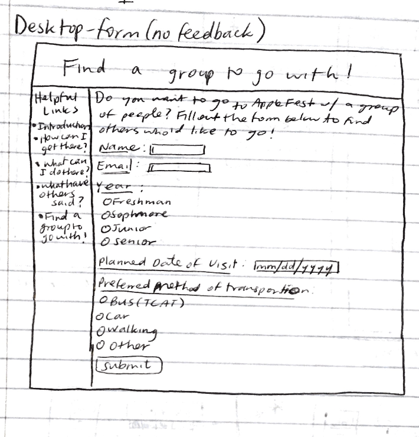

**Mobile Sketches**

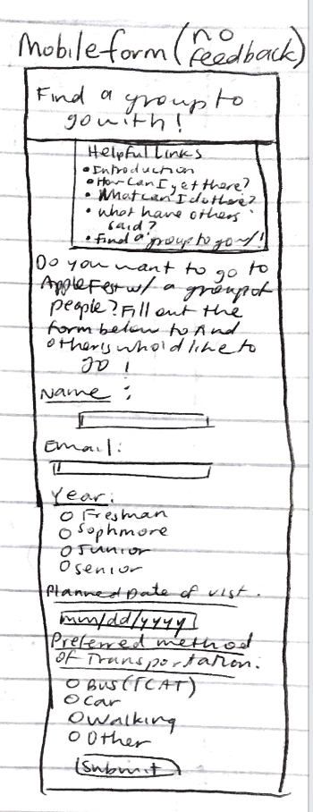

> What submission method will your form use? GET or POST. Explain your reasoning.
My form will use the POST submission method, because POST is used when data should only be sent to the server once, and since this form includes a required submission of the user's name and email, this is more private information that I don't think needs to be sent to the server more than once.

### Determine the Form Validation Criteria (Milestone 1)
> For each control in your form, specify the validation criteria AND your reasoning behind the criteria.

- Name
  - reasoning: Name is required because the users filling out this form should know who they are going to go to AppleFest with. It must be alphabetical because otherwise it is not a valid name, and must contain at least one character because otherwise it'd be blank.
  - required/optional: `required`
  - constraints: must be alphabetical, must have at least one character

- Email
  - reasoning: Email is required is because it is easier to type in than a phone number, and the users should have a way to contact the group they will be going with. It must be a valid email, and must have the "@" symbol because otherwise it would not be a valid email.
  - required/optional: `required`
  - constraints: must be a valid email (i.e. must have the "@" symbol)

- Year
  - reasoning: Year is required because the user might want to have a preferred general age to go with them to AppleFest, whether they'd like the same year as them, or someone younger to show them around, or someone older to be guided because they haven't gone to AppleFest before.
  - required/optional: `required`
  - constraints: must select one of the options

- Planned Date of Visit
  - reasoning: The planned visit date is required because if the people in the group do not have the same date they'd like to go to AppleFest, they should not be in the same group.
  - required/optional: `required`
  - constraints: must check at least one of the days to go to AppleFest

- Preferred Method of Transportation
  - reasoning: This should be required because people would want to know what kinds of transportation others in their group would want as well, and if one person wanted to walk while another preferred a bus, they would not be compatible to be in the same group  
  - required/optional: `required`
  - constraints: must select one of the options

- Submit
  - reasoning: This is needed because you need it to submit the form and find a group to go with
  - required/optional: required
  - constraints: must complete all of the required criteria from the rest of the form


### Design Form Feedback (Milestone 1)
> Include sketches of your **mobile and desktop** _feedback_.

**Desktop Feedback**

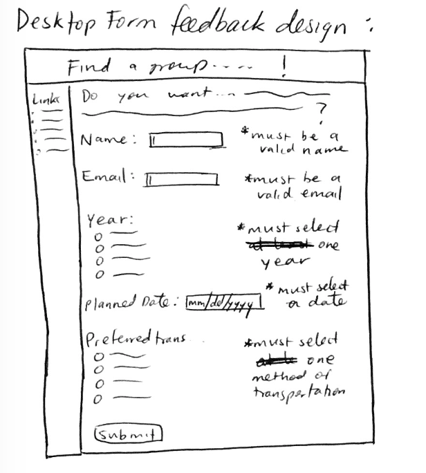


**Mobile Feedback**

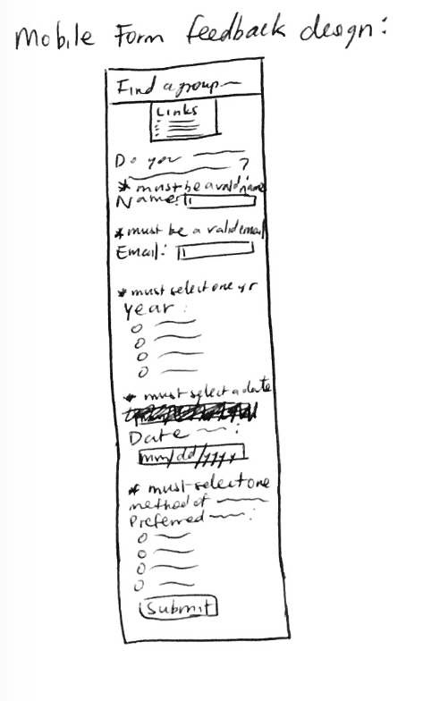


### User Testing Plan (Milestone 1)
> Plan out your **one** task to evaluate your form.

Task: You want to go to AppleFest but you have no friends to go with. Try to find a group by filling out the form with the email "example@cornell.edu"


### User 1 - Testing Notes (Milestone 1)
> When conducting user testing, you should take notes during the test. Place your notes here.

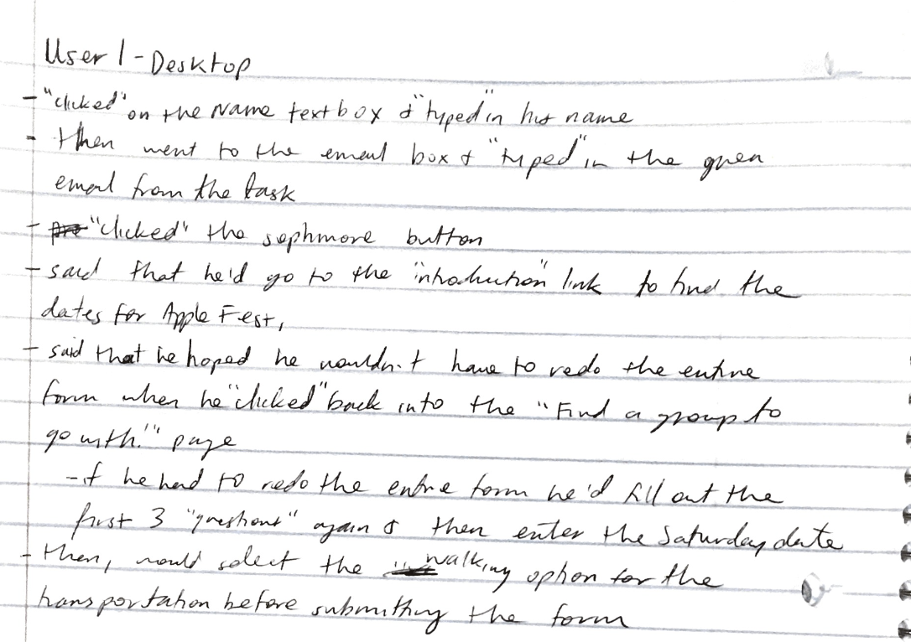

### User 1 (Milestone 1)
> Using your notes from above, describe your user 1 by answering the questions below.

1. Who is your user 1, e.g., where user 1 comes from, what is your user 1’s job, characteristics, etc.?

User 1 is from Queen, New York, and is a CS major but also enjoys the humanities as well. He is a sophomore and often leaves work to the last minute because he tends to procrastinate, which leads to him staying up late and then being tired the next day.

2. Does your user 1 belong to your target audience of the site? (Yes / No)

Yes, because he enjoys new experiences and would most likely want a break from school especially after a long assignment.

> If “No”, what’s your strategy of associating the user test results to your target audience’s needs and wants? How can your re-design choices based on the user tests make a better fit for the target audience?


### User 1 - **Desktop** (Milestone 1)
> Report the results of your user 1 evaluation. You should explain **what the user did**, describe the user's **reaction/feedback** to the design, **reflect on the user's performance**, determine what **re-design choices** you will make. You can also add any additional comments. See the example design journey for an example of what this would look like.

- **Did you evaluate the desktop or mobile design?**
  - Desktop design
- **How did the user do? Did they meet your expectation?**
  - The user was able to complete the task without any glaring issues, and seemed to be able to do it in a fairly quick amount of time, which was expected, because I don't think this form is too difficult. He was able to fill out the needed information and submitted it without any issues.
- **User’s reaction / feedback to the design** (e.g., specific problems or issues found in the tasks)
  - His reaction to the filling out the planned date to visit AppleFest was that he said he'd click on the "Introduction" link to see if the dates were there, and that he hoped that the form would save if he went back to it after clicking on another link. He said that if it wasn't, he would just have to fill everything out again, and while that wouldn't take too long, I think that he seemed very hopeful that he wouldn't have to do that.
- **Your reflections about the user’s performance to the task**
  - I think that he performed this task well, and that his comment about hoping that the form wouldn't have to be re-filled out when he went back to it after "clicking" onto another page was well-placed, because it was something that I hadn't thought of.
- **Re-design choices**
  - I think that the preferred date of the visit to AppleFest needs to be changed, because I don't want the user to have to click onto another link and then have to refill out the form if the answers weren't saved. Maybe I could put the dates next to the words "Planned Date of Visit", or make it radio buttons or checkboxes instead.
- **Additional Notes**
  - TODO: Justify your decisions; additional notes.


### User 2 - Testing Notes (Milestone 1)
> When conducting user testing, you should take notes during the test. Place your notes here.

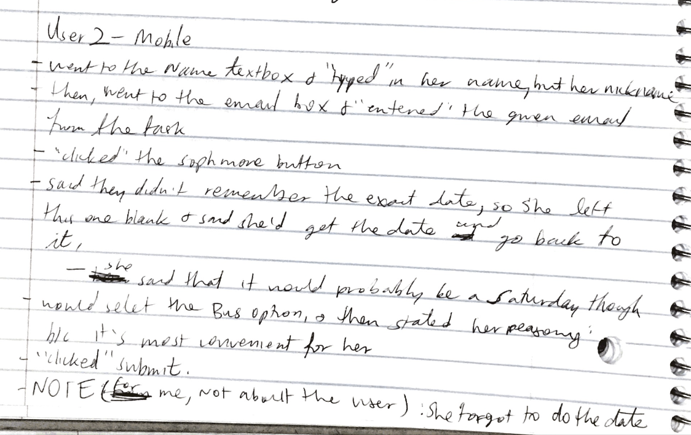

### User 2 (Milestone 1)
> Using your notes from above, describe your user 2 by answering the questions below.

1. Who is your user 2, e.g., where user 2 comes from, what is your user 2’s job, characteristics, etc.?

User 2 is from Boston, and she is an Information Science major. She is a very diligent and extremely hard worker, and spends a lot of time working on her homework because she wants it to be very perfect.

2. Does your user 2 belong to your target audience of the site? (Yes / No)

Yes, because she seems stressed a lot of the times.
> If “No”, what’s your strategy of associating the user test results to your target audience’s needs and wants? How can your re-design choices based on the user tests make a better fit for the target audience?


### User 2 - **Mobile** (Milestone 1)
> Report the results of your user 2 evaluation. You should explain **what the user did**, describe the user's **reaction/feedback** to the design, **reflect on the user's performance**, determine what **re-design choices** you will make. You can also add any additional comments. See the example design journey for an example of what this would look like.

- **Did you evaluate the desktop or mobile design?**
  - Mobile design
- **How did the user do? Did they meet your expectation?**
  - The user was able to complete most of the task with ease, except for the planned date, because she forgot to back and finish it before submitting. After she submitted, she seemed to think she was done with the task, even when the date wasn't filled in, which may be because it was on paper and she wasn't able to fill it in for real. Besides this, she was able to put in all the other information without any problems.
- **User’s reaction / feedback to the design** (e.g., specific problems or issues found in the tasks)
  - She thought that the "questions" were fairly easy because she did them without any trouble, all except for the date. For this, she paused and said that she'd have to go back to that one after checking up on the exact dates, but then stated that she'd go on a Saturday date. Then, she continued on to the rest of the form. She "clicked" submit without realizing that she never actually did go back to the date "question".
- **Your reflections about the user’s performance to the task**
  - I think that along with user 1's reaction to the asked "planned date of visit", her reaction should have been expected, because I guess I should have thought about how the dates weren't on this page, and when I was designing the form, I never took into account that the dates weren't present.
- **Re-design choices**
  - The dates definitely need to be presented in a better, way, perhaps with checkboxes or radio buttons, so that the users wouldn't have to manually find the dates and type it all in.
- **Additional Notes**
  - TODO: Justify your decisions; additional notes.


### Design Changes (Milestone 1)
> Use the space provided here to document any design changes from testing.

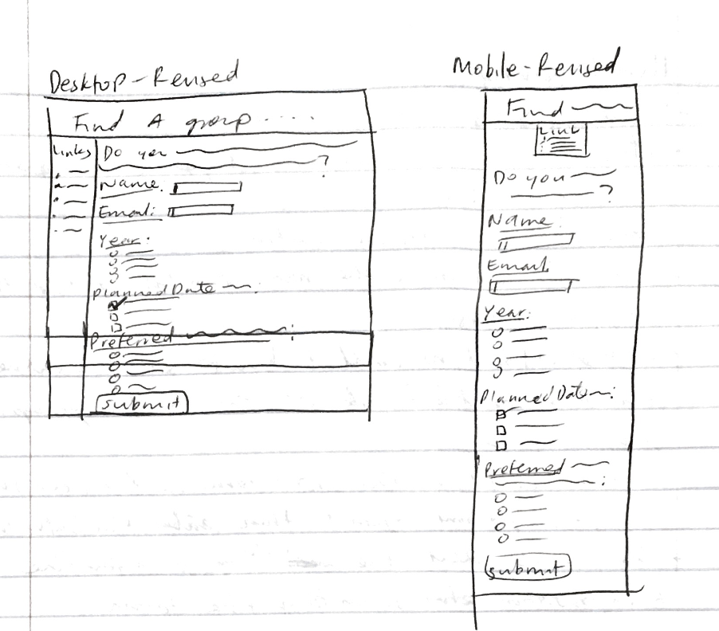

These are the revised designs of the Desktop and Mobile forms. They would all be the same except for the "Planned Date of Visit". I decided that it would be better to use checkboxes instead of a "date" input type, so that the users would not have to leave the page to go find out the exact dates for AppleFest. With checkboxes, I could give them the different choices of dates right there, and unlike radio buttons, they can choose more than one date in case they were planning to go more than one day.


### Additional Information (Milestone 1)
> (optional) Include any additional information, justifications, or comments we should be aware of.


---

## Polished & Tested Form

###  Plan Validation Pseudocode (Final Submission)
> Write your form validation pseudocode here.

```
  When DOM is loaded(event):
    When form is submitted(event):
        formValid = true;

        if the name is valid and the text HTML5 criteria has been met:
            hide name feedback
        else:
            show name feedback
            formValid = false;

        if email HTML5 criteria has been met:
            hide email feedback
        else:
            show email feedback
            formValid = false;

        if one of the buttons for the year is selected:
            hide year feedback
        else:
            show year feedback
            formValid = false;

        if at least one of the checkboxes for the planned day is selected:
            hide day feedback
        else:
            show day feedback
            formValid = false;

        if one of the buttons for the method of transportation is selected:
            hide transportation feedback
        else:
            show transportation feedback
            formValid = false;

        send form to server if formValid is true (submit the form)
```

### User Testing Plan (Final Submission)
> This should probably be the same task from your first round of testing unless you have a reason to change it.

Task: You want to go to AppleFest but you have no friends to go with. Try to find a group by filling out the form with the email "example@cornell.edu"


### User 3 - Testing Notes (Final Submission)
> When conducting user testing, you should take notes during the test. Place your notes here.

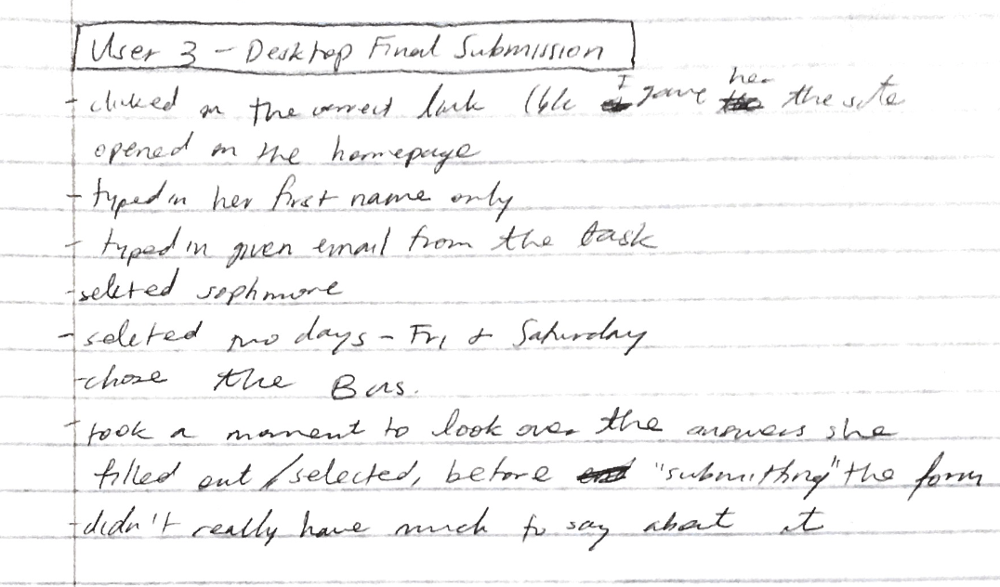

### User 3 (Final Submission)
> Using your notes from above, describe your user 3 by answering the questions below.

1. Who is your user 3, e.g., where user 3 comes from, what is your user 3’s job, characteristics, etc.?
User 3 is from Califorina, but used to live in Korea. She is a Computer Science major in the College of Engineering, and though usually a very hardworker, sometimes can put other things off just so she can finish something else, like skipping a discussion in order to finish a pset for another class. She is also usually a very shy person, and doesn't talk alot in discussion-like classes.

2. Does your user 3 belong to your target audience of the site? (Yes / No)
Yes, user 3 belongs to the target audience.

> If “No”, what’s your strategy of associating the user test results to your target audience’s needs and wants? How can your re-design choices based on the user tests make a better fit for the target audience?


### User 3 - **Desktop** (Final Submission)
> Report the results of your user 3 evaluation. You should explain **what the user did**, describe the user's **reaction/feedback** to the design, **reflect on the user's performance**, determine what **re-design choices** you will make. You can also add any additional comments. See the example design journey for an example of what this would look like.

- **Did you evaluate the desktop or mobile design?**
  - Desktop design
- **How did the user do? Did they meet your expectation?**
  - The user was able to complete the task without any issues. She typed in all the needed information, used the given email from the task, and was able to submit without any problems. She only typed in her first name, typed in the right email, and then after selecting the Sophomore radio button, selected the Friday and Saturday checkboxes before finally choosing the Bus option for the method of transportation. Afterwards, she read through the entire form very quickly to look at the answers she typed/selected, and then submitted.
- **User’s reaction / feedback to the design** (e.g., specific problems or issues found in the tasks)
  - She honestly didn't say very much about the design, though I am not sure if this is because the design was good enough to not be commented on, or because she is normally just a quieter person. She did seem to think that the form went by very fast, because she filled it out without any problems and in less than two minutes, even with scanning over the entire form again before submitting it.
- **Your reflections about the user’s performance to the task**
  - I think that the user performed the task very well, because she did it all without asking me any questions about anything, and without having to see any of the feedback messages.
- **Re-design choices**
  - I don't think that I would re-design anything major based on user 3's reactions, because she didn't really have one, to be honest. Maybe I could add in a few pictures, to make the page seem more interesting, though when I was designing the form, and added in pictures,
- **Additional Notes**
  - TODO: Justify your decisions; additional notes.


### User 4 - Testing Notes (Final Submission)
> When conducting user testing, you should take notes during the test. Place your notes here.

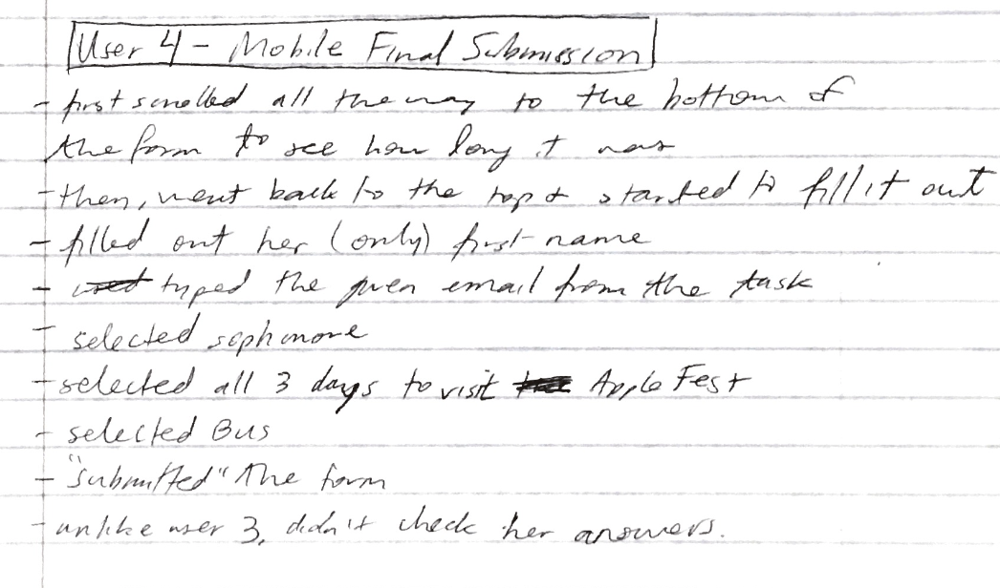

### User 4 (Final Submission)
> Using your notes from above, describe your user 4 by answering the questions below.

1. Who is your user 4, e.g., where user 4 comes from, what is your user 4’s job, characteristics, etc.?
User 3 is from Long Island, New York, but originally lived in Taiwan until highschool. She is a premed student in the school of Human Ecology, and tends to nonstop study when her prelims start to happen. Sometimes, she can even have four prelims in one week, and during those times, she is usually found studying in the library.

2. Does your user 4 belong to your target audience of the site? (Yes / No)
Yes, user 4 belongs to the target audience.

> If “No”, what’s your strategy of associating the user test results to your target audience’s needs and wants? How can your re-design choices based on the user tests make a better fit for the target audience?


### User 4 - **Mobile** (Final Submission)
> Report the results of your user 4 evaluation. You should explain **what the user did**, describe the user's **reaction/feedback** to the design, **reflect on the user's performance**, determine what **re-design choices** you will make. You can also add any additional comments. See the example design journey for an example of what this would look like.

- **Did you evaluate the desktop or mobile design?**
  - Mobile design
- **How did the user do? Did they meet your expectation?**
  - The user did well on the task, and didn't have any questions, which met my expectations. Before doing the task, she scrolled down to the bottom, because this was the mobile version and all the questions weren't visible without having to scroll down. Then, after scrolling back up, she completed the form without any issues, filling out her first name, the given email, selecting sophomore, selecting all 3 days, and then selecting the bus option, before submitting the form. She, unlike user 3, did not check her answers.
- **User’s reaction / feedback to the design** (e.g., specific problems or issues found in the tasks)
  - Her reaction was first to scroll all the way down, perhaps to see how long the entire form was, or to check and see what the questions she would have to fill out are. She didn't seem to mind though, and I think that this is because we are so used to scrolling on our phones, that it wouldn't matter much, and she didn't have to scroll down extremely far.
- **Your reflections about the user’s performance to the task**
  - I think that the user performed the task very well, and was able to do the task without any issues.
- **Re-design choices**
  - I think that perhaps for the mobile design, I could potentially add in a little sentence at the top that says that the form will be 5 "questions", so that if people are scrolling down to see how many questions there are, they don't necessarily have to, because they can read that there were 5 questions to begin with.
- **Additional Notes**
  - TODO: Justify your decisions; additional notes.


### Design Changes (Final Submission)
> Use the space provided here to document any design changes from testing.

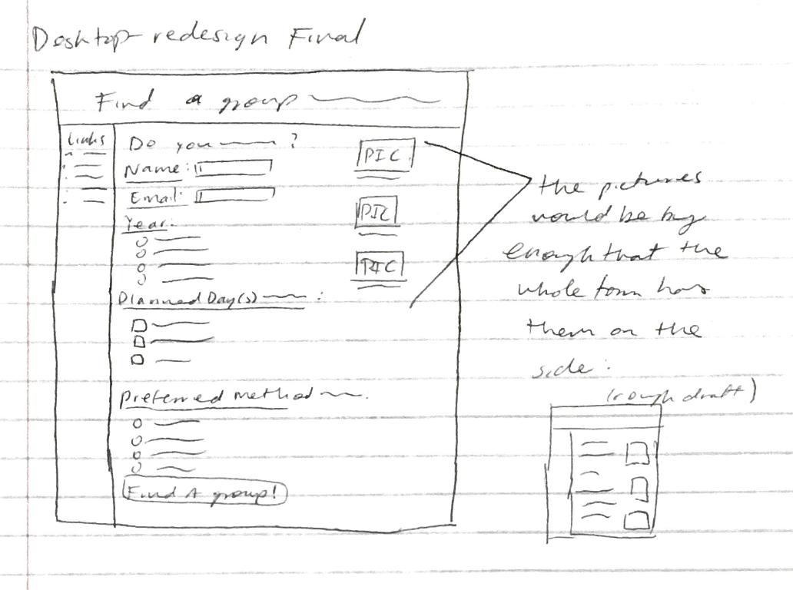

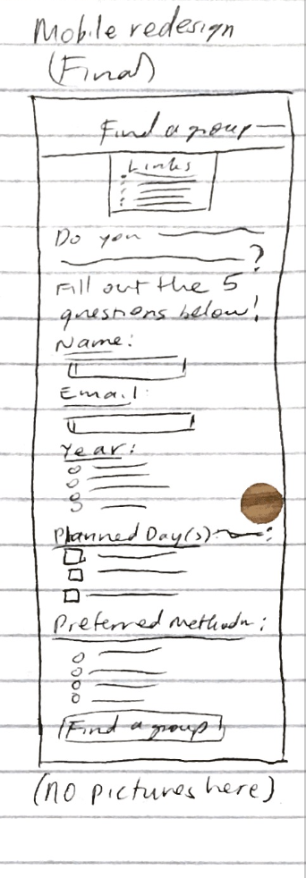

There would be no pictures in the mobile design, because they would not be able to see the entire page when they are filling out the form. The photos would end up just being placed after the submit button, and by the time they scroll to the submit button, they will just click that button. The pictures will be useless because they wouldn't go back to the form just to look at them.
The photos are just to make the desktop design seem less empty, but in the mobile design, the same problem isn't there because the form takes up the whole screen.


### Additional Design Justifications (Final Submission)
> If you feel like you haven’t fully explained your design choices in the final submission, or you want to explain some functions in your site (e.g., if you feel like you make a special design choice which might not meet the final requirement), you can use the additional design justifications to justify your design choices. Remember, this is place for you to justify your design choices which you haven’t covered in the design journey. Use it wisely. However, you don’t need to fill out this section if you think all design choices have been well explained in the final submission design journey.


### Self-Reflection (Final Submission)
> This was the first project in this class where you coded some JavaScript. What did you learn from this experience?

I learned that even if displaying feedback may seem like a very simple thing to accomplish, with JavaScript you actually have to be very specific. When trying to code the feedback for the checkboxes, I had a little trouble at first, because it made sense that if I wanted to make sure at least one box was checked, I could code this the same way that I did the radio buttons, because for the buttons, I *also* wanted to make sure at least one button was selected. However, this meant that I didn't take into consideration what would happen if the user selected more than one day, and ran into some problems while testing my own code there. I ended up having to add in every single combination of checkboxes that the user could potentially select. I had to be much more meticulous and specific when it came to coding with JavaScript. 

> Take some time here to reflect on how much you've learned since you started this class. It's often easy to ignore our own progress. Take a moment and think about your accomplishments in this class. Hopefully you'll recognize that you've accomplished a lot and that you should be very proud of those accomplishments!
